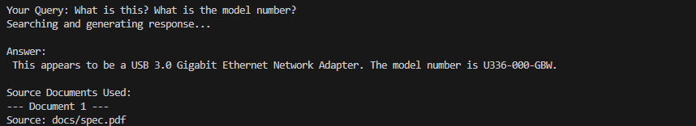

# spec-query

This is a lightweight Retrieval-Augmented Generation (RAG) application designed to answer technical questions from a PDF spec sheet using LangChain and Ollama.

# Installation

- Requires ollama with mistral 7b running on the background
- Install dependencies (Use Virtual Environment preferably):
  ```
  pip install -r requirements.txt
  ```
- Place documents in docs/
  `python app.py`

# Output


